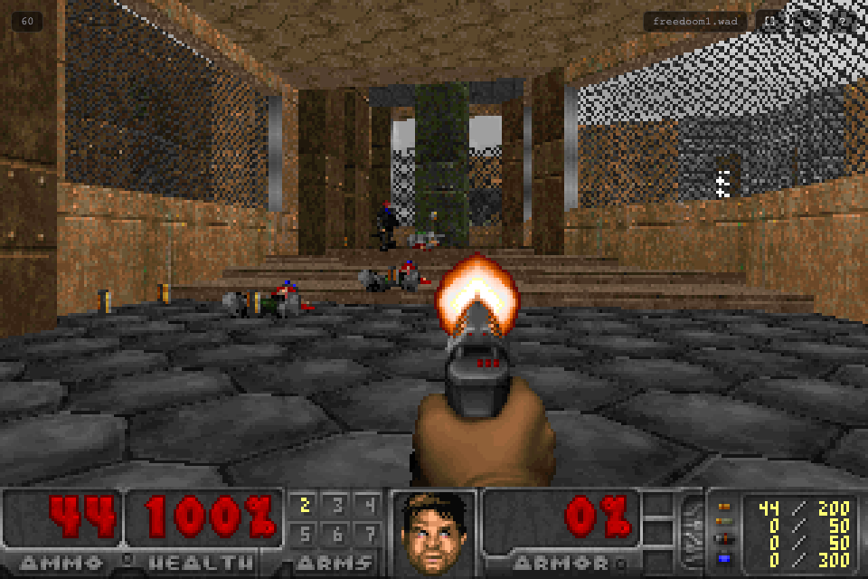

# Browser DOOM

A playable, fully client-side **DOOM** that runs entirely in your web browser —
no install, no backend, no accounts.

It bundles the [doomgeneric](https://github.com/ozkl/doomgeneric) engine compiled
to WebAssembly (a fork of the original LinuxDOOM 1.10 source port) together with
[Freedoom: Phase 1](https://freedoom.github.io/) — a free, libre replacement for
the classic DOOM — so it plays out of the box with a real game. You can also load
your own legally-owned `.wad` IWAD at runtime via drag-and-drop or the file picker,
and your choice is remembered across sessions.

> **This repo is a thin shell, not a game.** The hard part — the DOOM engine, the
> game data, the music instruments, the original 1993 game design — is other
> people's work, redistributed here unmodified under their own licenses.
> [lofihippo](https://github.com/lofihippo) wrote only the ~600 lines of browser
> glue that wire them together. See **[Credits](#credits)**.



---

## Quick start (run it)

The app is a **static website** — there is nothing to compile. Just serve the
folder over HTTP and open it in a browser.

**Option A — npm (recommended):**
```bash
cd /path/to/Browser-DOOM
npm install        # installs the tiny http-server dev dependency (or use any static server)
npm run dev        # serves on http://localhost:8080
```

**Option B — Python (no Node needed):**
```bash
cd /path/to/Browser-DOOM
python3 -m http.server 8080
```

**Option C — any static server** (VS Code "Live Server", `npx http-server -p 8080`, etc.).

Then open **http://localhost:8080** in a modern browser (Chrome, Firefox, Edge, Safari).

> ⚠️ **Do not open `index.html` by double-clicking it.**
> The app is an ES module that loads the WebAssembly engine and WADs over HTTP;
> browsers block `fetch()` and module loading on the `file://` scheme, so the
> buttons would look "dead." If you open it that way, the page shows a message
> telling you to use a local server. Always serve from `http://localhost`.

Click **Play** to start, or **Load WAD…** / drag a `.wad` onto the window to play a
custom IWAD.

---

## Features

- ✅ **Fully client-side** — the engine runs as WebAssembly in your browser; nothing
  is uploaded, and the game runs locally once the page is loaded.
- ✅ **Ready to play** — bundled **Freedoom: Phase 1** (a complete, free replacement
  for DOOM's game data).
- ✅ **Keyboard + mouse controls** — move with WASD/arrows, turn with the mouse, fire,
  strafe, run, and use Doom's in-game menus.
- ✅ **Runtime WAD loading** — drag-and-drop or pick a `.wad` to play any legally-owned
  IWAD (DOOM, DOOM II, Final Doom, Heretic, Hexen, FreeDM, Freedoom, …).
- ✅ **Persistent game selection** — your chosen WAD is stored in IndexedDB and
  restored on the next visit; **Use Freedoom** returns to the bundled default.
- ✅ **Fullscreen toggle** and a lightweight HUD (FPS + current game name).
- ✅ **Save / load** via Doom's in-game save menu (persisted in the browser's
  virtual file system / IndexedDB).

---

## Controls

| Action              | Control |
|---------------------|---------|
| Move forward        | `W` / `↑` |
| Move backward       | `S` / `↓` |
| Strafe left / right | `A` / `D`, or `←` / `→` |
| Turn                | Mouse (click the canvas to capture the pointer) |
| Fire                | Mouse button / `Ctrl` |
| Open / use          | `Space` |
| Run                 | `Shift` |
| Strafe              | `Alt` |
| Map                 | `Tab` |
| Game options        | `F1` |
| Save / load game    | `F2` / `F3` |
| In-game menu        | `Esc` |

> This source port is based on the classic DOOM engine, which turns horizontally —
> there is no vertical mouse-look. It plays the full mission content of whichever
> IWAD you load (Freedoom Phase 1 by default, or your own DOOM/DOOM II, etc.).

---

## Playing a custom WAD

1. Click **Load WAD…** on the start screen, **or** drag any `.wad` file onto the window.
2. The page reloads and boots the game with your WAD; your selection is saved so it
   is used next time.
3. Click **Use Freedoom** to clear your custom WAD and return to the bundled default.

Notes:

- Files are never uploaded — everything runs locally in your browser.
- **Full-game IWADs** (`.wad` files starting with the `IWAD` header) are supported.
  **PWAD** files (mods/patches) and **PK3/ZIP** archives are *not* supported by this
  engine and are rejected with a clear message.
- For best results use a retail IWAD named like `doom.wad` / `doom2.wad`. The engine
  auto-detects DOOM, DOOM II, Final Doom, Heretic, Hexen, FreeDM, Freedoom, Hacx,
  Chex Quest, and Strife. Any other filename is treated as DOOM II.

---

## Run requirements

| Requirement | Detail |
|-------------|--------|
| Browser     | A modern browser that supports **WebAssembly** and **WebGL** (Chrome, Firefox, Edge, Safari) |
| Server      | Any static HTTP server (the app will not run from `file://`) |
| Node.js     | Only needed for the optional `npm run dev` command; not required to play |

---

## How it works (architecture)

This is a thin web shell around an unmodified, prebuilt engine.

```
Browser (http://localhost:8080)
   │
   ├─ index.html        UI shell: boot screen, game screen, help screen
   ├─ style.css         styling
   ├─ config.js         paths to the engine + default WAD
   └─ app.js            bootstrap + logic
         │
         │ 1. resolve the WAD to use (bundled Freedoom, or a user IWAD
         │    persisted in IndexedDB)
         │ 2. seed the Emscripten Module (canvas, locateFile, onRuntimeInitialized)
         │ 3. inject <script src="engine/doomgeneric.js"> → loads .wasm + .data
         │ 4. on onRuntimeInitialized, write the chosen WAD into the engine's
         │    virtual file system (FS_unlink / FS_createDataFile), then main()
         │    auto-runs
         │ 5. engine renders via SDL2 → WebGL onto <canvas id="canvas">
         ▼
   engine/   doomgeneric (Emscripten WebAssembly, GPL-2.0)
      doomgeneric.js      Emscripten glue
      doomgeneric.wasm    compiled engine
      doomgeneric.data    GUS instruments + id's shareware IWAD (unused, see notices)
   public/
      freedoom1.wad       default game data (Freedoom Phase 1)
```

Key details:

- **Engine bootstrap.** `app.js` seeds `window.Module` with the canvas, a `locateFile`
  override (so the glue finds `.wasm`/`.data` in `engine/`), and an
  `onRuntimeInitialized` hook. It then injects the engine `<script>`, which loads the
  WebAssembly + data package and auto-runs the engine's `main()`.
- **WAD injection.** The chosen WAD is written into the Emscripten **FS** using
  `Module['FS_unlink']` / `Module['FS_createDataFile']` inside `onRuntimeInitialized` —
  which fires after the bundled data is loaded and just before `main()`. The baked-in
  shareware base is removed so Doom's IWAD search finds only the intended game.
- **No re-encoding.** Freedoom and user WADs are streamed straight into the WASM FS
  as-is; nothing is converted.
- **Persistence.** Data that must survive a reload lives in **IndexedDB** (active WAD)
  and the Emscripten FS (save games). WAD bytes are re-validated on load.
- **No threads / no COOP-COEP.** The engine is single-threaded, so it works with any
  simple static server and needs no special HTTP headers.

---

## Uninstall / remove

There is no installer — this is a static web app, so "uninstalling" just means
removing the folder and clearing browser-stored data.

**Remove the project folder:**
```bash
rm -rf /path/to/Browser-DOOM
```

**Remove the npm dev dependency (if you ran `npm install`):**
```bash
cd /path/to/Browser-DOOM
rm -rf node_modules package-lock.json
```

**Clear browser data the app created** (active custom WAD, save games), per browser:

- **Chrome / Edge:** Settings → Privacy and security → Cookies and other site data →
  find `localhost:8080` → **Delete** (also clears the IndexedDB `browser-doom` database).
- **Firefox:** Settings → Privacy & Security → Cookies and Site Data → Manage Data →
  remove `localhost:8080`.
- **Safari:** Preferences → Privacy → Manage Website Data → remove `localhost`.

No server processes, services, or background tasks are left behind — just stop the
one-off `python3 -m http.server` / `npm run dev` with **Ctrl+C** in its terminal.

---

## Project layout

```
/ 
  index.html               UI shell (boot / game / help screens)
  style.css                styling
  app.js                   WAD handling, engine bootstrap, IndexedDB persistence, controls UI
  config.js                static paths to the engine + default WAD
  package.json             npm metadata + dev server script (http-server)
  .gitignore
  engine/                  doomgeneric WASM engine (GPL-2.0 prebuilt)
    doomgeneric.js         Emscripten glue
    doomgeneric.wasm       compiled engine
    doomgeneric.data       GUS instruments + id's shareware IWAD (unused)
    LICENSE                GPL-2.0 license for the engine
  public/
    freedoom1.wad          default game data (Freedoom Phase 1)
  docs/
    screenshot.png
  LICENSE                  MIT license for this wrapper project
  THIRD_PARTY_NOTICES.md   bundled third-party licenses
```

---

## Licensing

This project combines code and game data under different licenses.

- **Wrapper (this repo's own code)** — `index.html`, `style.css`, `app.js`,
  `config.js`, docs: **MIT** (see `LICENSE`).
- **Engine** — [doomgeneric](https://github.com/ozkl/doomgeneric) WebAssembly build
  of the LinuxDOOM 1.10 source port: **GPL-2.0** (see `engine/LICENSE` and the
  doomgeneric repository). Because the engine is GPL-2.0, redistributing it must
  comply with the GPL-2.0 terms.
- **Default game data** — **Freedoom Phase 1** (`public/freedoom1.wad`): a permissive
  **BSD-style** license (copyright Freedoom contributors).
- **Music instruments** — the Gravis Ultrasound patch set inside
  `engine/doomgeneric.data`: packaged into the public domain by Simon Howard
  (fraggle), but the `.pat` files themselves carry a 1992–94 Advanced Gravis /
  EYE & I Productions copyright with **no explicit redistribution grant**. Treat
  their status as unclear.

See **`THIRD_PARTY_NOTICES.md`** for the full text, the GPL-2.0 source offer, and
per-component notices.

> **Legal note — id Software shareware data is present.** The prebuilt engine data
> package `engine/doomgeneric.data` contains id Software's **DOOM shareware IWAD**
> (`doom1.wad`, "Knee-Deep in the Dead"), baked in by the upstream doomgeneric build
> and redistributed here verbatim. It is **proprietary to id Software** — not free
> software — although id distributed it as shareware and its in-game notice states it
> "can be freely distributed." It is **unused at runtime**: `app.js` deletes it from
> the engine's virtual filesystem before the game starts, so play always uses Freedoom
> or a WAD you supply. If you fork or host this, note that you are redistributing that
> data too; `THIRD_PARTY_NOTICES.md` explains how to strip it.
>
> No *retail* id Software assets (DOOM, DOOM II, Final Doom) are distributed here.
> Users may load their own legally owned WAD files at runtime; those files stay on
> the user's machine and are never uploaded.

---

## Credits

Browser DOOM exists because of decades of work by other people. In rough order of
how much of the thing you are actually playing they are responsible for:

- **[id Software](https://www.idsoftware.com/)** — John Carmack, John Romero, Tom
  Hall, Adrian Carmack, Kevin Cloud, Sandy Petersen, Dave Taylor, Bobby Prince and
  colleagues — who wrote DOOM in 1993 and then, in 1997, released the engine source
  so that projects like this one could exist at all. DOOM and its trademarks remain
  theirs; this project is unaffiliated with and unendorsed by id Software, ZeniMax,
  or Microsoft.
- **[ozkl](https://github.com/ozkl) and the doomgeneric contributors** — for the
  portable source port and the WebAssembly build that does all the real work here.
- **The [Freedoom](https://freedoom.github.io/) contributors** — the artists, level
  designers and composers who rebuilt an entire DOOM-compatible game from scratch
  so that ports like this have something legal and free to ship.
- **Simon Howard (fraggle)**, with Tom Klok, Sebastien Bacquet and Jaydee — for
  packaging and configuring the GUS instrument patches that give the music its voice.
- **The [Emscripten](https://emscripten.org/) project** — for the toolchain that puts
  a 1993 C codebase in a browser tab.
- **[lofihippo](https://github.com/lofihippo)** — assembled this repository and wrote
  the browser wrapper (`index.html`, `style.css`, `app.js`, `config.js`, docs). That
  is the only part of this repo authored here.

---

## Troubleshooting

**Buttons look "dead" / nothing happens on Play or Load WAD.**
You almost certainly opened `index.html` via `file://`. Serve the folder over HTTP
(see **Quick start**) and open `http://localhost:8080`.

**How do I switch back to the bundled game?**
On the start screen click **Use Freedoom**.

**A WAD I dropped in didn't load.**
It may be a PWAD (mod) or a PK3/ZIP archive, which this engine doesn't support.
Use a full-game `.wad` with an `IWAD` header.

**No sound?**
Click the page first (browsers require a user gesture before audio starts), then
check OS/browser volume and that the tab isn't muted.

**Does it need internet?**
Only to load the page and its assets once. After the page is loaded the game runs
locally in your browser.

---

## Browser compatibility

Tested on modern Chrome, Firefox, Edge and Safari. iOS/Safari can run the engine, but
internal mouse-capture behavior may differ on touch devices. A browser that supports
WebGL is required for the SDL2 renderer.
